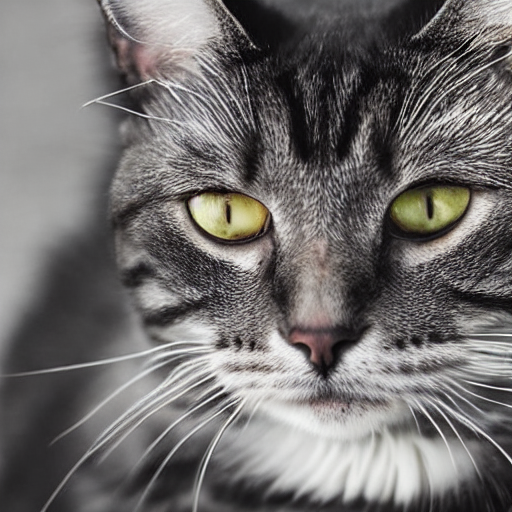
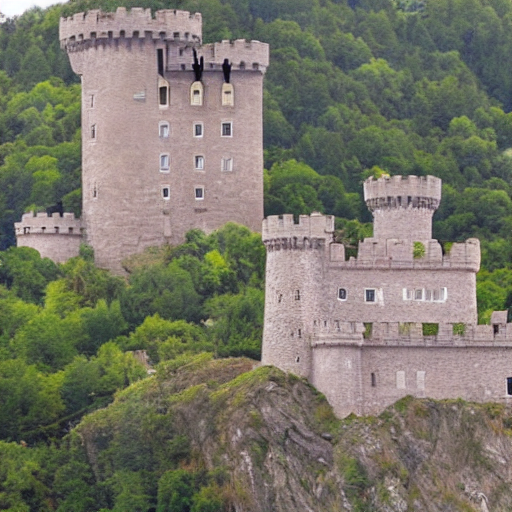
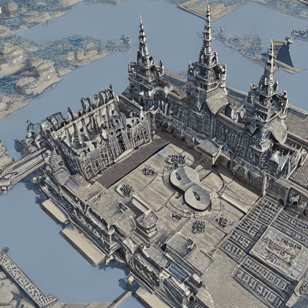
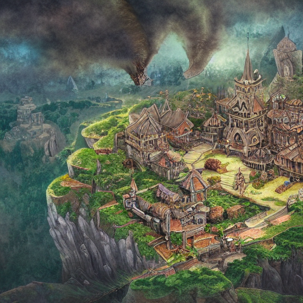
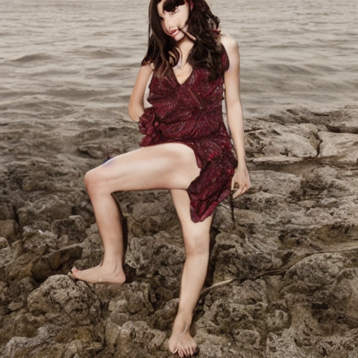
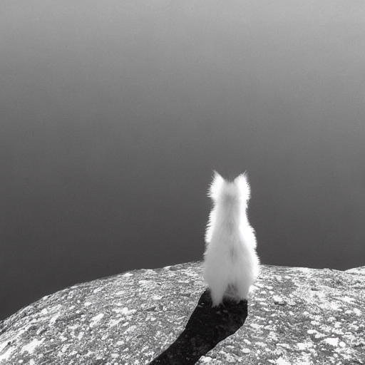
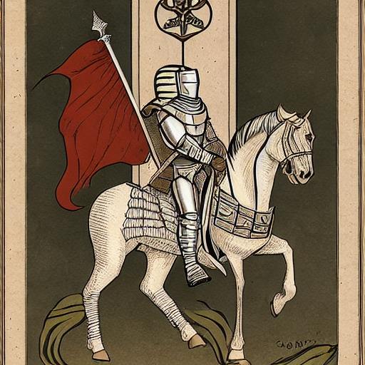
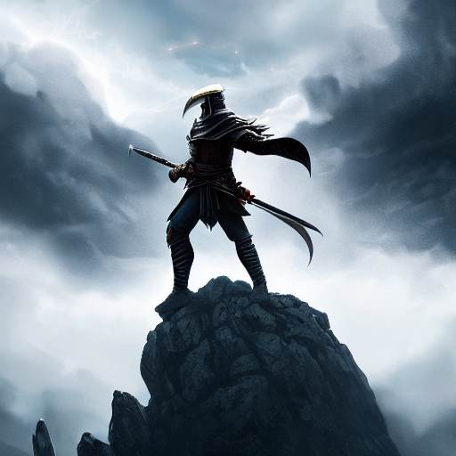

# 🎨 프롬프트 엔지니어링 워크숍 포트폴리오

> Stable Diffusion AI를 활용한 이미지 생성 실습 결과물

## 👤 수강생 정보

| 항목 | 내용 |
|------|------|
| **이름** | 조유노 |
| **학번** | 21023 |
| **작성일** | 2026년 01월 23일 |
| **총 작품 수** | 8개 |

---

## 📚 회차별 학습 기록

### 📖 1회차: 첫 AI 이미지 생성

**학습 기법**: 기본 프롬프팅

#### 작품 1

| 항목 | 내용 |
|------|------|
| **프롬프트** | `a cat, one of the strongest animals` |
| **네거티브** | `-` |
| **생성 시간** | 2026-01-23 05:41:28 |

> 자세히 써야  좋고 영어를 잘 알아야 좋다.

---

### 📖 2회차: Zero-shot vs Detail

**학습 기법**: 상세 프롬프팅

#### 작품 1

| 항목 | 내용 |
|------|------|
| **프롬프트** | `a castle` |
| **네거티브** | `-` |
| **생성 시간** | 2026-01-23 05:48:38 |

> 제로샷은 내가 상상한 것과 일치하게 나올 확률이 매우 낮으며 실망스러울 때가 많다. 하지만 디테일하게 프롬프트를 입력하면 내가 원하는 특징을 모두 담을 수 있고 내가 생각한 것과 비슷하게 나와 만족할 수 있다.

#### 작품 2

| 항목 | 내용 |
|------|------|
| **프롬프트** | `a grand castle which has 5 areas. gray and blue. very big, more than a city. fantasy, 4k` |
| **네거티브** | `-` |
| **생성 시간** | 2026-01-23 05:48:38 |

> 제로샷은 내가 상상한 것과 일치하게 나올 확률이 매우 낮으며 실망스러울 때가 많다. 하지만 디테일하게 프롬프트를 입력하면 내가 원하는 특징을 모두 담을 수 있고 내가 생각한 것과 비슷하게 나와 만족할 수 있다.

---

### 📖 3회차: Persona & Style

**학습 기법**: 스타일 프롬프팅

#### 작품 1

| 항목 | 내용 |
|------|------|
| **프롬프트** | `a kingdom, with village, grand, fantasy, big, fantasy art style, magical, epic, detailed illustration, overcast lighting, soft diffused light, bird's eye view, top-down perspective` |
| **네거티브** | `-` |
| **생성 시간** | 2026-01-23 05:53:54 |

> 스타일 이라는 큰 틀을 잡아주는 것 만으로 전체적인 이미지의 느낌을 잡을 수 있고 내가 원하는 분위기의 그림을 생성하는데 큰 도움이 된다.

---

### 📖 4회차: Negative Prompting

**학습 기법**: 네거티브 프롬프팅

#### 작품 1

| 항목 | 내용 |
|------|------|
| **프롬프트** | `a beautiful portrait of a young woman, dress, beach background, soft lighting, white long hair, grab sword, fly` |
| **네거티브** | `poorly drawn face, mutation, deformed, ugly, old, unrealistic` |
| **생성 시간** | 2026-01-23 06:20:17 |

> 네거티브 프롬프트를 이용해 내가 정말 싫어하는 요소들을 배제할 수 있다는 장점이 있지만 좋은 모델을 활용하는 것이 아닌 경우 오히려 모델이 이해를 잘 하지 못해 역효과가 날 수 있다.

---

### 📖 5회차: Step-back Prompting

**학습 기법**: 추상화 프롬프팅

#### 작품 1

| 항목 | 내용 |
|------|------|
| **프롬프트** | `alone` |
| **네거티브** | `blurry, low quality, distorted, text, watermark` |
| **생성 시간** | 2026-01-23 06:29:21 |

> 스텝백이 그렇게 중요한가? 했는데 있을 때 없을 때를 비교해보니 확실히 중요함. 특히 추상적인 주제를 근본부터 이해하여 내가 원하는 느낌과 분위기의 그림 생성이 가능함.

---

### 📖 6회차: Chain of Thought

**학습 기법**: 레이어 빌딩

#### 작품 1

| 항목 | 내용 |
|------|------|
| **프롬프트** | `a knight, holding a sword above one's head, a flagged hill, sunset glow, 3D game` |
| **네거티브** | `blurry, low quality` |
| **생성 시간** | 2026-01-23 06:35:49 |

> 레이어를 쌓을수록 더 자세한 그림이 완성됨.

---

### 📖 7회차: 종합 실습

**학습 기법**: 종합

#### 작품 1

| 항목 | 내용 |
|------|------|
| **프롬프트** | `A knight who only sees the dragon above the sky hidden behind the clouds and looks up from below to fight against it with only a silhouette due to lightning, fantasy art, magical, epic, detailed illustration, cinematic, dramatic lighting, movie still` |
| **네거티브** | `blurry, low quality, distorted, ugly, bad anatomy` |
| **생성 시간** | 2026-01-23 06:41:11 |

> 자세히, 다양히 프롬프트를 작성할수록 내 기대에 부합한다.

---

## 🏆 Best 작품

**선택한 작품**: 

**선택 이유**: 

---

## 💡 워크숍 후기

---

## 🛠️ 사용 기술

- Stable Diffusion
- Streamlit
- Google Colab + ngrok

---

<i>🎓 KNU 프롬프트 엔지니어링 워크숍 수료</i>

